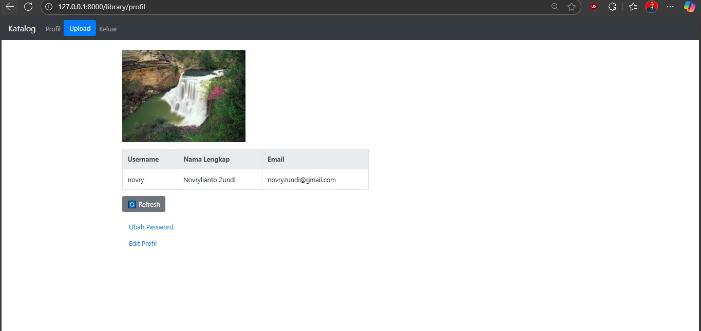

# Library CIHEUL – Django Project

Perkenalkan saya Novrylianto Zundi Ramadhan selaku calon kandidat dari seleksi Ciheul Technologies.  
Project ini menggunakan Django 4.2.23 dan kompatibel dengan PostgreSQL 12. Khusus fitur login dan registrasi saya terinspirasi dari simple-django-login-and-register milik egorsmkv, namun tetap dikostumisasi sesuai instruksi soal, salah satunya penambahan dan edit foto profil, fitur login-registrasi saya letakkan di struktur app 'accounts' . Sementara itu CRUD Library beserta preview buku dan analisis keyword relevan yang saya kerjakan berada di struktur app 'library'.

## Screenshots
| Detail Buku All Tomorrow | Detail Buku Laskar Pelangi | Edit Buku | Edit Profil | Hapus Buku modal | Keyword NLTK modal | Login | Modal Preview Buku | Profil | Registrasi akun | Set Unset Favorit Buku | Tampilan Filter Favorit Buku | Tampilan Semua Buku | Tampilan awal belum login regristrasi | Upload Buku |
|----------|----------|----------|----------|----------|----------|----------|----------|----------|----------|----------|----------|----------|----------|----------|
|  |  |  |  |  |  |  |  |  |  |  |  |  |  |  |

## Petunjuk Instalasi

```cmd
:: 1. Buat dan aktifkan virtual environment
python -m venv venv_tesprogram
venv_tesprogram\Scripts\activate.bat

:: 2. Clone repository
git clone https://github.com/nofuri18/libraryciheulnov.git
cd library-ciheul

:: 3. Install dependencies
pip install -r requirements.txt

:: 4. Konfigurasi database
:: Ubah file :
source/app/conf/development/settings.py 
:: Saya menggunakan PostgreSQL 12

:: 5. Lakukan migrations
python source/manage.py migrate

:: 6. Jalankan server
python source/manage.py runserver

